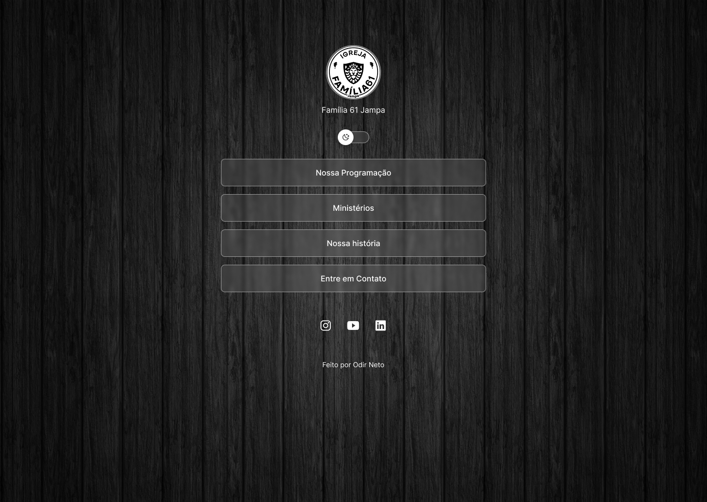

<h1 align="center"> Família 61 Jampa </h1>

Projeto criado exclusivamente para a Igreja Família 61 Jampa

  <a href="#-tecnologias">Tecnologias</a>&nbsp;&nbsp;&nbsp;|&nbsp;&nbsp;&nbsp;
  <a href="#-projeto">Projeto</a>&nbsp;&nbsp;&nbsp;|&nbsp;&nbsp;&nbsp;
  <a href="#-layout">Layout</a>&nbsp;&nbsp;&nbsp;|&nbsp;&nbsp;&nbsp;
  <a href="#memo-licença">Licença</a>

  

 

  

## 🚀 Tecnologias

Esse projeto foi desenvolvido com as seguintes tecnologias:

- HTML e CSS
- Figma
- JavaScript
- Git e Github

## 💻 Projeto

O Projeto Família 61 Jampa é um projeto que mostra informações e contatos da Igreja Família 61 em João Pessoa - PB

## 🔖 Layout

Você pode visualizar o layout do projeto através [DESSE LINK](<https://www.figma.com/design/HvfXdeGqSSznL0pAI5Esq5/DevLinks-%E2%80%A2-Projeto-Discover-(Community)?node-id=1439-736&m=dev>). É necessário ter conta no [Figma](https://figma.com) para acessá-lo.

## :memo: Licença

Esse projeto está sob a licença MIT.

---

Feito por Odir Neto como projeto para finalização do curso DISCOVER, da ROCKETSEAT
